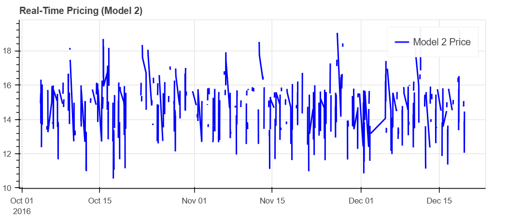
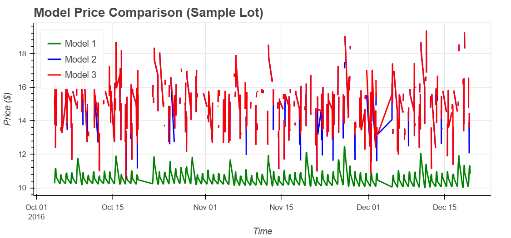
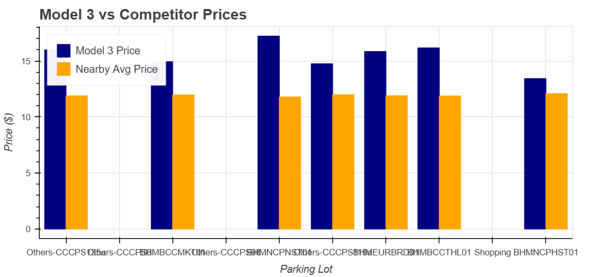
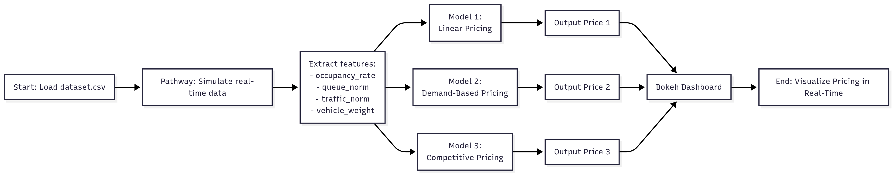

## View and interact with the full notebook (including Bokeh graphs) in Colab:  
> [](https://colab.research.google.com/drive/1JODr7XY2DybsgRna7nXqNnPTuGjjDWyX?usp=sharing)

## Project Summary:

Urban parking lots often suffer from poor pricing strategies — either they’re too expensive and go empty, or too cheap and overcrowded. Our project, **Dynamic Pricing for Urban Parking Lots**, tackles this issue by building a real-time pricing system that adjusts parking fees based on live conditions.

We’ve developed three smart models that automatically update prices using inputs like:

- **How full the lot is**
- **Length of queues**
- **Traffic in the surrounding area**
- **Special events happening nearby**
- **Type of vehicle (car, bike, etc.)**
- **Prices at competing parking lots**

By leveraging **Pathway**, we simulate a constant stream of live data and make on-the-fly price changes. We also use **Bokeh** to visually show how prices behave over time across different models.

---

## Tools & Technologies:

- **Python** – The main language used for building logic and models
- **Pandas** – To clean and prepare the data
- **NumPy** – For number crunching
- **Pathway** – To handle streaming and simulate real-time updates
- **Bokeh** – For creating interactive graphs and plots
- **Google Colab** – Cloud-based environment for development
- **GitHub** – For version control and collaboration

---

##  Real-Time Price Visualizations (Bokeh Plots)
These visualisations show how prices vary depending on occupancy, queue levels, and competition, using various pricing models.
---

### Real time pricing over time(model1)
This graph shows how prices change over time based on demand-based factors like queue and occupancy



---

### Comparison of Pricing Models
This line graph illustrates the pricing trends of Models 1, 2, and 3 during the identical timefram


---

###  Model 3 vs Competitor Pricing
This bar chart illustrates the comparison between Model 3 prices and the average prices at competing parking lots nearby.


---

## System Architecture:

Here’s a simple diagram that shows how data moves through the system — from raw input to final price output.



---

## Project Workflow:

Our goal was to simulate a **real-time dynamic pricing system** for city parking. The process covers everything — from reading the data and extracting useful features, to applying our pricing models and visualizing the outcomes.

### Step-by-Step Breakdown:

1. **Importing the Data**
   - We started with a dataset covering 14 parking locations over 73 days.
   - Combined date and time into one column to create time-based features.

2. **Creating New Features**
   - We extracted:
     - `occupancy_rate` = Number of parked vehicles ÷ Capacity
     - Scaled versions of queue length and traffic congestion
     - A binary indicator for special days (`IsSpecialDay`)
     - Vehicle weights (e.g., car = 1.0, bike = 0.5)

3. **Basic Linear Pricing (Model 1)**
   - Price goes up as the lot fills up:
     ```
     Price = Base_Price + α × (Occupancy / Capacity)
     ```

4. **Demand-Based Pricing (Model 2)**
   - We added more factors (traffic, events, vehicle type, etc.) into a demand score.
   - The final price adjusts smoothly based on normalized demand:
     ```
     Price = Base_Price × (1 + λ × Normalized_Demand)
     ```

5. **Competitor-Aware Pricing (Model 3)**
   - On top of Model 2, this model checks competitor pricing.
   - If competitors are cheaper, we lower our prices; if they're more expensive, we raise ours.

6. **Real-Time Simulation with Pathway**
   - We mimic live data streaming.
   - Pathway ensures everything stays in the right order and pricing stays up to date.

7. **Visualizing Results with Bokeh**
   - Time-series plots show how prices evolve.
   - Bar charts compare prices across models and competitors.
   - Bokeh makes it easy to explore the pricing behavior interactively.

---

### Key Components:

- `Feature Engineering & Preprocessing` – Turning raw logs into structured, useful data
- `Model Development` – Building the pricing models one step at a time
- `Real-Time Simulation` – Using Pathway to mimic how the system would behave live
- `Visualization` – Graphs that clearly show how each model responds over time

---

## Assumptions and Notes:

- We handpicked the weights for demand factors (α, β, γ, etc.) based on trial and error and what made sense in context.
- To simulate real-time flow, data was fed in order using timestamps.
- Special days were simplified to a yes-or-no tag (1 or 0).
- We only used two vehicle types for now: cars (weight = 1.0) and bikes (weight = 0.5).
- Prices were capped between $5 and $20 to stay realistic.
- In Model 3, we compared prices at nearby lots (at the same time) to decide if our rates needed adjusting.
